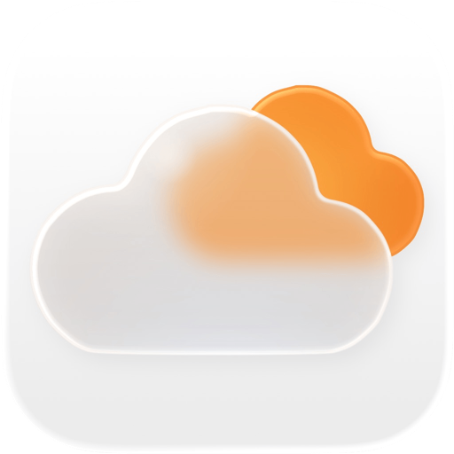

<div align="center">



# Orange Cloud

**A native Cloudflare client for iPhone, iPad & Apple Watch — sign in with OAuth, no API tokens to paste.**

<a href="https://apps.apple.com/app/id6779323783"></a>
&nbsp;
<a href="https://www.producthunt.com/products/orange-cloud?embed=true&amp;utm_source=badge-featured&amp;utm_medium=badge&amp;utm_campaign=badge-orange-cloud" target="_blank" rel="noopener noreferrer"></a>

<a href="https://apps.apple.com/app/id6779323783"></a>

[Website](https://orange-cloud.chatiro.app) · [Privacy](https://orange-cloud.chatiro.app/privacy) · [Terms](https://orange-cloud.chatiro.app/terms) · [TestFlight (beta)](https://testflight.apple.com/join/ZGhbsphj) · [Telegram](https://t.me/orange_cloud_channel)

[English](#english) | [中文](#中文)

</div>

---

## English

Orange Cloud is a third-party Cloudflare management app for iPhone, iPad, and Apple Watch, built entirely with Swift and SwiftUI. Unlike other clients, it signs you in through Cloudflare's official **OAuth 2.0 + PKCE** flow — there's no API token to copy and paste. The baseline is iOS 17, with iOS 18 / 26 capabilities layered on progressively on the devices that support them.

<div align="center">


</div>

### Features

- **OAuth 2.0 + PKCE sign-in** with per-scope permission selection; tokens live in the Keychain only, and multiple Cloudflare accounts can stay signed in side by side.
- **Domains & DNS** — zone list, full DNS record CRUD, one-tap proxy toggle, and zone settings.
- **Analytics** — zone traffic via the GraphQL Analytics API, rendered with Swift Charts (24-hour for free, 7-day / 30-day with Pro).
- **Workers** — script list and details, plus real-time log streaming (`wrangler tail`-style WebSocket trace) with a Live Activity on the Lock Screen and in the Dynamic Island.
- **Snippets** — view, edit, and create zone-level Cloudflare edge code and its trigger rules.
- **Storage** — R2 bucket and object browsing, D1 SQL console, and KV key-value management.
- **Security & network** — WAF custom rules (view / toggle) and Cloudflare Tunnel status.
- **Apple Watch app** — your domains and 24-hour requests on your wrist, with watch-face complications.
- **Deep system integration** — Home Screen and Lock Screen widgets, Control Center controls, Siri / App Intents, Spotlight indexing, background token refresh, and an iPad split-view layout.
- **Localized** in 9 languages: English, 简体中文, 繁體中文（台灣）, 繁體中文（香港）, 日本語, Español (México), 한국어, Português (Brasil), and Português (Portugal).

### Free, Pro, and open source

The app is free with a single account and the complete Domains / DNS toolset. A Pro subscription — or a one-time purchase — in the official App Store build unlocks multiple accounts, the Storage tab (R2 / D1 / KV), live Workers logs, WAF, Tunnel, Snippets, and 7-day / 30-day analytics. Every Home Screen and Lock Screen widget, the Apple Watch app, and all Siri shortcuts stay free.

This repository is licensed under **AGPL-3.0 + Commons Clause**. You're free to build the app for yourself — adding the `OPENSOURCE_UNLOCKED` compilation condition unlocks **every** Pro feature in your own build at no cost. The Commons Clause only forbids selling the software commercially; everything else the AGPL allows. See [LICENSE](LICENSE), [TRADEMARK.md](TRADEMARK.md), and [CLA.md](CLA.md) for the details.

### Repository layout

```
orange-cloud/
├── apps/
│   ├── ios/        # The iOS / iPadOS / watchOS app (Swift / SwiftUI, Xcode project)
│   ├── android/    # The Android client (Kotlin / Jetpack Compose) — feature-complete, in closed testing
│   └── web/        # Landing page + OAuth callback relay (Next.js on Cloudflare Workers)
├── package.json    # pnpm workspaces root
└── turbo.json
```

### Android

A native **Kotlin + Jetpack Compose** client lives in [`apps/android/`](apps/android/README.md). It carries iOS's design language and OAuth-first approach, rebuilt the Android-native way rather than mirrored screen for screen, and covers the same core:

- **OAuth 2.0 + PKCE** multi-account sign-in, with tokens kept in the Android Keystore.
- **Domains & DNS**, **Analytics** (GraphQL + hand-drawn charts), and **Workers** with live log tailing via an ongoing notification.
- **Storage** — R2 (browse / upload / download), D1 (SQL console plus table browsing and row editing), and KV.
- **Security & network** — WAF custom rules (create / toggle / delete) and Cloudflare Tunnel.
- **Android touches** — Material You dynamic color over the daybreak theme, an adaptive two-pane layout for tablets and foldables, home-screen shortcuts, a Quick Settings tile, predictive back, and per-app language — localized in the same 9 languages.

It's feature-complete and in **closed testing — not yet on Google Play**. The open-source story matches iOS: the `oss` build flavor unlocks every Pro feature at no cost.

### Community

Follow the [Telegram channel](https://t.me/orange_cloud_channel) for release notes, news, and announcements.

### Building from source

1. **Xcode 26 or later.** Open `apps/ios/Orange Cloud/Orange Cloud.xcodeproj`. The app targets iOS 17 and watchOS 10.6, with an embedded Apple Watch companion app.
2. Create your own **Cloudflare OAuth client** and deploy your own callback relay (see [`apps/web/`](apps/web/README.md)) — the official client ID and the `orange-cloud.chatiro.app` relay are not available to third-party builds.
3. Add `OPENSOURCE_UNLOCKED` to the main target's `SWIFT_ACTIVE_COMPILATION_CONDITIONS` for the full feature set.
4. Change the Bundle ID, App Group, and signing team to your own.

Full details, including the contribution workflow and CLA, are in [CONTRIBUTING.md](CONTRIBUTING.md).

---

## 中文

Orange Cloud 是一款面向 iPhone、iPad 与 Apple Watch 的 Cloudflare 第三方管理客户端，完全使用 Swift 与 SwiftUI 构建。与其他客户端不同，它通过 Cloudflare 官方 **OAuth 2.0 + PKCE** 流程登录——无需手动复制粘贴 API Token。以 iOS 17 为基线，并在支持的设备上渐进增强 iOS 18 / 26 的新能力。

<div align="center">


</div>

### 功能

- **OAuth 2.0 + PKCE 登录**，按 scope 勾选授权；Token 仅存 Keychain，支持多个 Cloudflare 账号并存切换。
- **域名与 DNS**——域名列表、DNS 记录增删改查、一键代理开关、域名设置。
- **流量分析**——基于 GraphQL Analytics API，用 Swift Charts 绘制图表（24 小时免费，7 天 / 30 天需 Pro）。
- **Workers**——脚本列表与详情，以及实时日志流（类似 `wrangler tail` 的 WebSocket trace），配合锁屏与灵动岛 Live Activity。
- **Snippets**——查看、编辑、新建 zone 级 Cloudflare 边缘代码及其触发规则。
- **存储**——R2 存储桶与对象浏览、D1 SQL 查询控制台、KV 键值管理。
- **安全与网络**——WAF 自定义规则（查看 / 启停）与 Cloudflare 隧道状态。
- **Apple Watch App**——在手腕上查看域名与 24 小时请求，并支持表盘 complication。
- **系统深度集成**——主屏与锁屏小组件、控制中心控件、Siri / App Intents、Spotlight 索引、后台 Token 静默刷新、iPad 双栏布局。
- **9 语言本地化**：简体中文、繁體中文（台灣）、繁體中文（香港）、English、日本語、Español（墨西哥）、한국어、Português（巴西）、Português（葡萄牙）。

### 免费、Pro 与开源

App 免费版支持单账号与完整的域名 / DNS 功能。在 App Store 官方版中，Pro 订阅（或一次性买断）可解锁多账号、存储 Tab（R2 / D1 / KV）、Workers 实时日志、WAF、隧道、Snippets，以及 7 天 / 30 天流量分析。所有主屏与锁屏小组件、Apple Watch App 以及全部 Siri 捷径始终免费。

本仓库采用 **AGPL-3.0 + Commons Clause** 许可：自行编译自用完全自由——为自编译构建添加 `OPENSOURCE_UNLOCKED` 编译条件，即可零成本解锁**全部** Pro 功能。Commons Clause 仅限制将本软件用于商业销售，AGPL 允许的其余权利不受影响。详见 [LICENSE](LICENSE)、[TRADEMARK.md](TRADEMARK.md) 与 [CLA.md](CLA.md)。

### 仓库结构

```
orange-cloud/
├── apps/
│   ├── ios/        # iOS / iPadOS / watchOS App（Swift / SwiftUI，Xcode 工程）
│   ├── android/    # Android 客户端（Kotlin / Jetpack Compose）——功能完整，封测中
│   └── web/        # 落地页 + OAuth 回调中转（Next.js on Cloudflare Workers）
├── package.json    # pnpm workspaces 根
└── turbo.json
```

### Android 版

原生 **Kotlin + Jetpack Compose** 客户端位于 [`apps/android/`](apps/android/README.md)。它延续 iOS 的设计语言与「OAuth 免贴 Token」理念，但以 Android 原生方式重写、而非逐屏镜像，覆盖同一套核心：

- **OAuth 2.0 + PKCE** 多账号登录，Token 仅存 Android Keystore。
- **域名与 DNS**、**流量分析**（GraphQL + 自绘图表）、**Workers** 实时日志（常驻通知）。
- **存储**——R2（浏览 / 上传 / 下载）、D1（SQL 控制台，含表浏览与行编辑）、KV。
- **安全与网络**——WAF 自定义规则（新建 / 启停 / 删除）与 Cloudflare 隧道。
- **Android 特色**——晨昏主题之上的 Material You 动态取色、平板与折叠屏自适应双栏、主屏长按快捷、快速设置磁贴、predictive back、每应用语言——同样本地化为 9 种语言。

功能已完整，正在**封闭测试——尚未上架 Google Play**。开源策略与 iOS 一致：`oss` 构建风味零成本解锁全部 Pro 功能。

### 社区

关注 [Telegram 频道](https://t.me/orange_cloud_channel)，获取版本更新、项目动态与发布公告。

### 自行编译

1. **Xcode 26 或更高版本**，打开 `apps/ios/Orange Cloud/Orange Cloud.xcodeproj`。App 面向 iOS 17 与 watchOS 10.6，并内嵌 Apple Watch 配套 App。
2. 自建 **Cloudflare OAuth Client** 并部署你自己的回调中转（见 [`apps/web/`](apps/web/README.md)）——官方 Client ID 与 `orange-cloud.chatiro.app` 中转不向第三方构建开放。
3. 向主 target 的 `SWIFT_ACTIVE_COMPILATION_CONDITIONS` 添加 `OPENSOURCE_UNLOCKED` 以解锁全部功能。
4. 将 Bundle ID、App Group 与签名团队改为你自己的。

贡献流程与 CLA 详见 [CONTRIBUTING.md](CONTRIBUTING.md)。

---

<div align="center">

© 2026 [chen2he](https://github.com/chen2he) · AGPL-3.0 + Commons Clause

</div>
